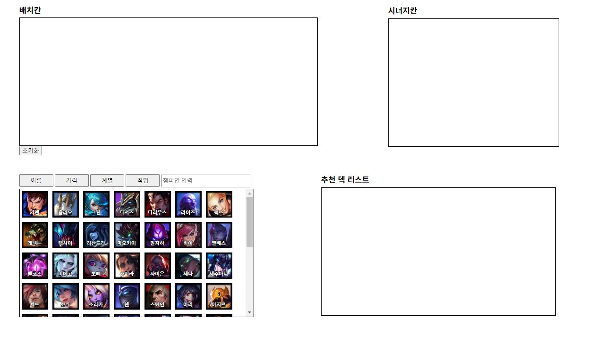
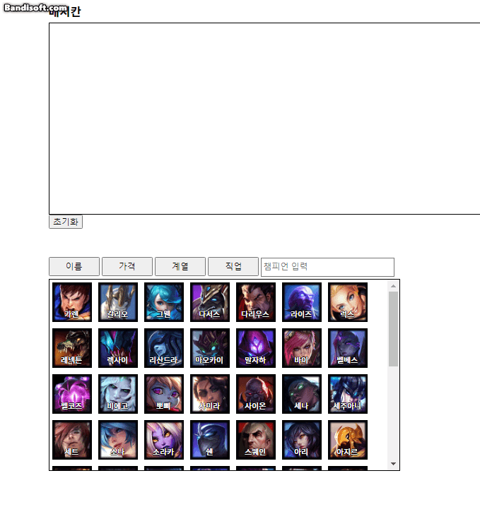
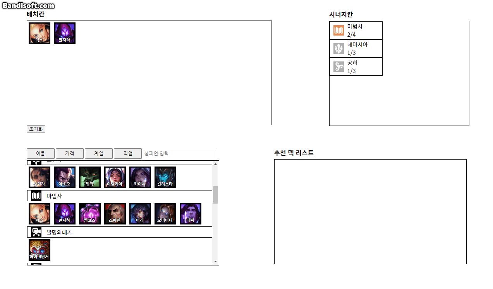
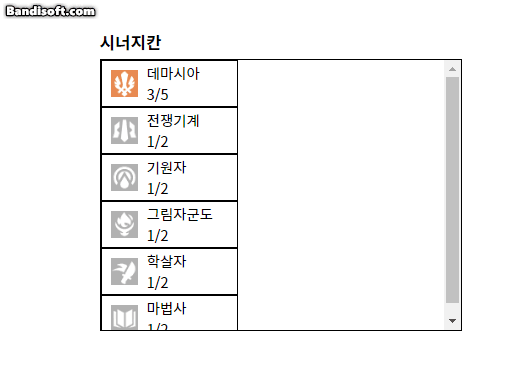

# TFT placement tool

TFT 배치 툴 & 덱 추천
---------
이 프로젝트는 HTML, CSS, javascirpt만 사용하여 만들었습니다. React, Vue or Angular와 같은 Framework는 일체 사용하지 않았습니다.

https://hogeun1999.github.io/TFT/ (수정필)

<br>

Homepage view
--------------
 <p align="center"></p>
<br>

Function introduction
----------------
- 배치칸  
챔피언을 클릭하면 위의 배치칸에 챔피언이 들어가며 해당하는 챔피언의 시너지에 맞춰 시너지칸의 시너지가 활성화 된다. 배치칸의 챔피언을 다시 누르면 삭제할 수 있다.

- 챔피언칸
  - 검색기능  
  챔피언의 수가 굉장히 많이 때문에 필요한 챔피언을 바로 찾을 수 있는 검색창을 구현했다.  
  한글의 특성때문에 한 글자를 완성해야 챔피언이 나오도록 만들었다. 

  - 정렬/초기화 버튼  
  검색창 왼쪽에 있는 4개의 버튼을 통해 챔피언을 정렬할 수 있다. 각각 이름, 가격, 계열별, 직업별로 챔피언을 정렬해서 손쉽게 찾아볼 수 있다.  
  <p align="center"></p>
- 시너지칸  
챔피언이 배치칸에 올라오면 시너지가 활성화 된다. 시너지는 특정 직업 또는 계열이 레벨에 만족하는 개수가 올라가게 되면 등급이 올라가며 색깔이 변하게 된다. 해당 시너지에 마우스를 올리면 활성화된 시너지 레벨 및 레벨에 따른 추가 능력치와 시너지 설명을 읽어볼 수 있다.

- 추천 덱 리스트칸  
여러가지 추천 덱 데이터가 존재하는데 사용자가 배치한 챔피언과 추천 덱의 챔피언이 `4개이상` 겹치게 되면 추천 덱 리스트 칸에 해당하는 덱을 추천해준다. 사용자는 추천 덱 리스트를 보고 여러 챔피언을 올려보며 덱을 완성하는데 도움을 받을 수 있다.
  <p align="center"></p>

UI/UX - CSS
------------
- UI/UX
 1. Grid를 통한 각각의 칸 위치 정렬
 ```css
#wrap {
    display: grid; // grid 적용
    grid-template-areas:  // grid를 통한 구역 나눔
        "arrangementBox SynergyBoxWrap"
        "championBoxWrap recommendChampion";
    grid-template-rows: 1fr 1fr;
    grid-template-columns: 710px 560px;
    align-items: center;
}

#arrangementBox {
    grid-area: arrangementBox; // 구역설정
    justify-self: start;
}

#SynergyBoxWrap{
    grid-area: SynergyBoxWrap;  // 구역설정
    justify-self: end;
}
```
2. 클릭 가능 아이템의 마우스 포인터 변경
```css
.championWrap{
    cursor: pointer;   //챔피언에 마우스 커서를 올렸을때 포인터 모양 변경
}
```
3. 클릭 가능 아이템의 임팩트 추가 
```css
.synergyDiv:hover {  // tag:hover를 통해 마우스를 올린 태그에 색깔 추가
    background-color: bisque;
}
.championWrap:hover{ // tag:hover를 통해 마우스를 올린 태그에 투명도 변경
    opacity: 0.8;
}
```
<p align="center"></p>

4. 챔피언 텍스트 가독성 향상
```css

```

<br>

*Caution
----------
이 홈페이지를 제작한 시기는 2023.07~2023.08 로 TFT 시즌9의 데이터를 사용했다.  
챔피언이나 추천 덱 데이터가 자동으로 갱신되는 것이 아니므로 시즌9 이후로  
넘어가게 되면 업데이트 하기 전까지는 실제로 게임을 하며 사용할 수 없음을 알려드립니다.


Future improvements
----------------
- Open API  
  Riot 에서 직접 제공하는 Open API를 활용해 다음 시즌 챔피언 및 시너지, 덱 정보 업데이트하기
- Additionnal Function  
 사용자들의 의견을 받아 기존에 없는 기능 추가 한다.   
 추후에 능력이 된다면 자음으로도 검색이 되도록 업데이트 할것이다.